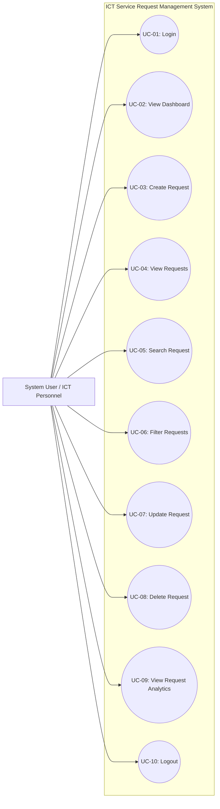
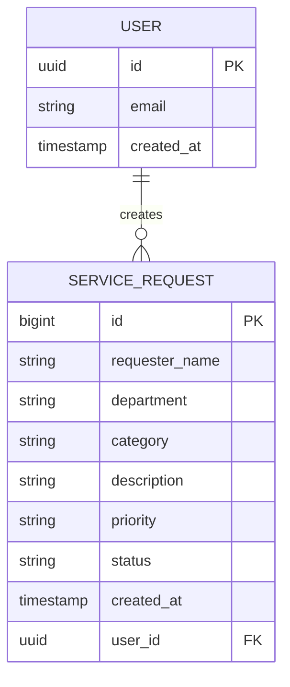

# Systems Analysis and Design (SAD) Documentation
## ICT Service Request Management System

**Course:** Systems Analysis and Design (SAD)  
**Target Organization:** University Information and Communications Technology (ICT) Office  
**Backend Platform:** Supabase PostgreSQL & Authentication  
**Front-End Stack:** HTML5, Vanilla CSS3, JavaScript (ES6+)  
**Deployment Platform:** GitHub Pages  

---

## 1. Problem Statement

The university's ICT Office currently receives technical support requests through unstructured channels including verbal requests, informal text messages, and social media chats. Consequently, support tickets are frequently forgotten, duplicated, or inadequately tracked. This lack of a centralized tracking mechanism leads to delayed resolutions, user dissatisfaction, and poor resource allocation. The ICT Service Request Management System provides a centralized web platform where authorized personnel can record, monitor, update, and resolve technical support requests systematically.

---

## 2. System Actors

| Actor | Type | Description |
| :--- | :--- | :--- |
| **System User / ICT Personnel** | Primary Actor | Authorized university staff member or ICT personnel who logs into the system to record, view, search, filter, update status, and delete technical support requests. |

---

## 3. Use Case Diagram

---

## 4. Entity Relationship Diagram (ERD)

---

## 5. Business Rules (BR)

| Rule ID | Rule Name | Requirement Description | Implementation Strategy |
| :--- | :--- | :--- | :--- |
| **BR-01** | Requester Validation | Requester name cannot be empty. | Form validation (`required`, trimmed string check). |
| **BR-02** | Department Validation | Department must be provided. | Form dropdown/input validation. |
| **BR-03** | Category Validation | Category must be selected from approved options. | Select dropdown validation. |
| **BR-04** | Description Validation| Description must contain sufficient detail (min 5 chars). | Textarea validation. |
| **BR-05** | Priority Assignment | Priority must be assigned as Low, Medium, or High. | Radio/Select validation. |
| **BR-06** | Default Status | New requests automatically receive 'Pending' status. | Database default constraint & JS payload default. |
| **BR-07** | Authentication Guard | Users must log in before managing service requests. | Supabase Auth session listener & route guards. |
| **BR-08** | Deletion Confirmation| Confirmation prompt must appear before deleting records. | Interactive confirmation modal dialog. |
| **BR-09** | Automated Timestamp | Creation date and time must be automatically recorded. | PostgreSQL `DEFAULT NOW()` & UTC formatting. |
| **BR-10** | Database Security | Unauthorized database modification must be prevented. | Supabase Row Level Security (RLS) policies. |

---

## 6. Requirements Traceability Matrix (RTM)

| Req ID | Requirement Description | System Feature | Implementation Module | Test Case ID |
| :--- | :--- | :--- | :--- | :--- |
| **FR-01** | User can log into the system securely | Login & Session Guard | `login.html`, `js/auth.js` | **TC-01** |
| **FR-02** | User can submit a new technical request | Service Request Form Modal | `index.html`, `js/app.js` | **TC-02** |
| **FR-03** | User can view all recorded service requests | Service Requests Table | `index.html`, `js/app.js` | **TC-03** |
| **FR-04** | User can edit and update existing requests | Request Edit Modal | `index.html`, `js/app.js` | **TC-04** |
| **FR-05** | User can delete unwanted or duplicate requests | Confirm Delete Dialog | `index.html`, `js/app.js` | **TC-05** |
| **FR-06** | User can search requests by name or description | Live Search Input Bar | `index.html`, `js/app.js` | **TC-06** |
| **FR-07** | User can filter requests by status and priority | Combined Filter Dropdowns | `index.html`, `js/app.js` | **TC-07** |
| **FR-08** | System displays total & categorized summary metrics | Dashboard Summary Cards | `index.html`, `js/app.js` | **TC-08** |
| **FR-09** | System displays Category & Priority distribution | Request Analytics Widget | `index.html`, `js/app.js` | **TC-09** |

---

## 7. Functional Test Suite & Results

| Test ID | Test Scenario | Execution Steps | Expected Result | Status |
| :--- | :--- | :--- | :--- | :---: |
| **TC-01** | User authentication with valid credentials | 1. Navigate to `login.html` 2. Input email & password 3. Click "Log In" | Authentication succeeds; user redirected to `index.html` dashboard. | **PASS** |
| **TC-02** | Create a new valid service request | 1. Click "+ New Request" 2. Fill in Requester, Dept, Category, Description, Priority 3. Submit form | Record is saved to Supabase; table reloaded; success toast displayed. | **PASS** |
| **TC-03** | Display all service requests in data table | 1. Log into system 2. View main page | Service requests table populates with formatted IDs, badges, and timestamps. | **PASS** |
| **TC-04** | Update request details and status | 1. Click "Edit" on a request 2. Change status to "In Progress" or "Completed" 3. Save changes | Database updates record; table and dashboard counters refresh dynamically. | **PASS** |
| **TC-05** | Delete request with confirmation guard | 1. Click "Delete" on a request row 2. Modal appears asking "Are you sure?" 3. Click "Confirm Delete" | Confirmation dialog pops up; record deleted from database; table updates. | **PASS** |
| **TC-06** | Search requests by requester or description | 1. Type term (e.g., "Wi-Fi" or "Juan") into search input | Table dynamically filters rows matching the query string instantly. | **PASS** |
| **TC-07** | Filter requests by status and priority | 1. Select Status = "Pending" 2. Select Priority = "High" | Only requests matching both Pending status and High priority remain visible. | **PASS** |
| **TC-08** | Dashboard metric counter verification | 1. Perform CRUD operations 2. Inspect Total, Pending, In Progress, Completed summary cards | Counter values accurately sum up state counts from the current dataset. | **PASS** |
| **TC-09** | Request Analytics distribution metrics | 1. View Analytics section 2. Compare category and priority counts with table | Dynamic breakdown graphs match database category and priority distributions. | **PASS** |
