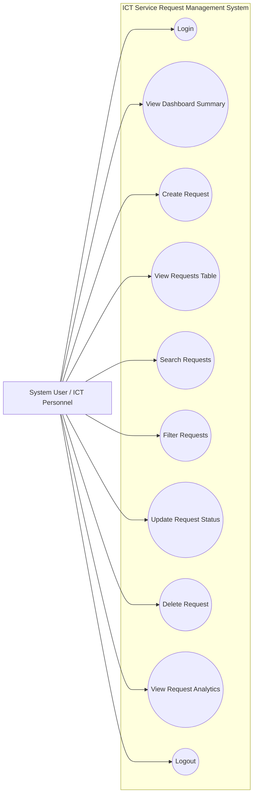
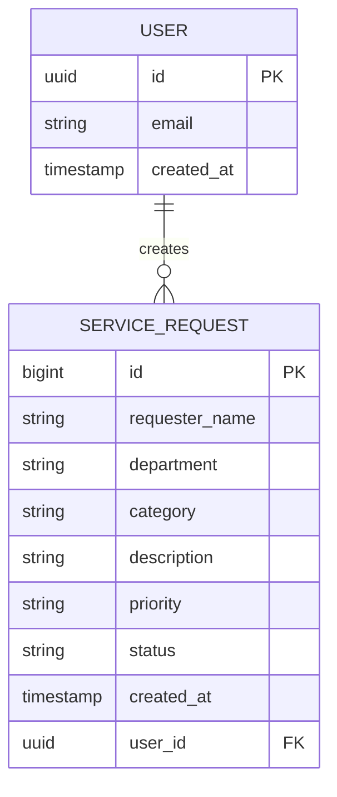

# ICT Service Request Management System

**Course:** Systems Analysis and Design (SAD)  
**Level:** Intermediate Software Development  
**Backend:** Supabase PostgreSQL Database + Authentication  
**Front-End:** HTML5, Modern Vanilla CSS3 (Glassmorphism), JavaScript (ES6+)  
**Deployment Target:** GitHub Pages  

---

## 📌 Submission Overview

- **Student Name:** JULIANNE TRISTAN E. DEQUINA
- **Section:** BSIS-3A  
- **Course Title:** Systems Analysis and Design (SAD)  
- **Supabase Project URL:** `https://kfbolysjloxvauqrxtye.supabase.co`  
- **Publishable Key:** `sb_publishable_QRRGM5APc7vR1tU4i_LZQA_VblMrHgV`  
- **GitHub Repository:** `https://github.com/username/SAD-ServiceRequest-DelaCruz`  
- **Live System (GitHub Pages):** `https://username.github.io/SAD-ServiceRequest-DelaCruz/`  
- **Test Credentials:** `student@example.com` / `password123`  

---

## 🏢 I. Scenario & Problem Statement

### Organizational Scenario
The university's Information and Communications Technology (ICT) Office currently receives technical concerns through fragmented channels, including verbal walk-ins, phone text messages, and social media chats. Because requests originate from unmonitored channels, technical issues are frequently forgotten, duplicated, or left unresolved without accountability.

### Problem Statement 
The university ICT Office suffers from delayed support resolutions due to fragmented communication channels (verbal, SMS, social media). Requests are lost, duplicated, and unmonitored. The **ICT Service Request Management System** addresses this problem by providing a secure, centralized web application where authorized personnel can record, monitor, update, filter, and analyze technical support requests transparently.

---

## 🏛️ II. System Architecture & Tech Stack

```
 INTERNET
    │
    ▼
 GitHub Pages (Static Hosting)
 ┌───────────────────────────┐
 │   HTML5 / CSS3 / JS       │
 └─────────────┬─────────────┘
               │
    Supabase JS Client (v2)
               │ HTTPS / REST API
               ▼
       SUPABASE BACKEND
 ┌───────────────────────────┐
 │ Authentication Service   │
 │ PostgreSQL Database      │
 │  └── service_requests    │
 └───────────────────────────┘
```

- **Front-End:** HTML5, Custom Vanilla CSS3 Design System with Glassmorphism, Responsive Mobile/Desktop Layouts, micro-animations.
- **Backend:** Supabase PostgreSQL Database with Row Level Security (RLS) policies.
- **Authentication:** Supabase Auth with JWT session state management & Auth Guards (BR-07).
- **Hosting:** GitHub Pages.

---

## 📐 III. Systems Analysis and Design (SAD) Artifacts

### 1. Primary System Actor
- **System User / ICT Personnel:** Authorized university personnel who logs in to submit, monitor, search, filter, update, and resolve ICT service requests.

### 2. Use Case Diagram



### 3. Entity Relationship Diagram (ERD)



---

## ⚖️ IV. Business Rules (BR-01 to BR-10)

| Rule ID | Rule Requirement | Implementation Mechanism |
| :--- | :--- | :--- |
| **BR-01** | Requester name cannot be empty. | Form input validation & trimmed string check. |
| **BR-02** | Department must be provided. | Required form field. |
| **BR-03** | Category must be selected. | Dropdown select validation (6 categories). |
| **BR-04** | Description must contain sufficient info. | Textarea minimum 5 characters constraint. |
| **BR-05** | Priority must be Low, Medium, or High. | Enforced select options (`Low`, `Medium`, `High`). |
| **BR-06** | New requests automatically receive Pending status. | DB column default `'Pending'` & JS creation payload. |
| **BR-07** | Users must log in before managing requests. | Route guard logic in `js/auth.js`. |
| **BR-08** | Confirmation must appear before deleting a record. | Custom modal dialog popup before execution. |
| **BR-09** | Date requested must automatically be recorded. | PostgreSQL `DEFAULT NOW()` & UTC formatting. |
| **BR-10** | Unauthorized database modification prevented. | Supabase Row Level Security (RLS) policies. |

---

## 📋 V. Requirements Traceability Matrix (RTM)

| Req ID | Requirement | System Feature | Test Case | Status |
| :--- | :--- | :--- | :--- | :---: |
| **FR-01** | User can log in | Login Page | **TC-01** | **PASS** |
| **FR-02** | User can create request | Request Form Modal | **TC-02** | **PASS** |
| **FR-03** | User can view requests | Request Data Table | **TC-03** | **PASS** |
| **FR-04** | User can update request | Request Edit Modal | **TC-04** | **PASS** |
| **FR-05** | User can delete request | Confirm Delete Dialog | **TC-05** | **PASS** |
| **FR-06** | User can search requests | Search Input Bar | **TC-06** | **PASS** |
| **FR-07** | User can filter requests | Filter Dropdowns | **TC-07** | **PASS** |
| **FR-08** | System displays summaries | Dashboard Cards | **TC-08** | **PASS** |
| **FR-09** | System displays analytics | Analytics Graphs | **TC-09** | **PASS** |

---

## 🧪 VI. Functional Testing Results

| Test ID | Scenario | Expected Result | Result |
| :--- | :--- | :--- | :---: |
| **TC-01** | Login using valid credentials | Dashboard appears; session token set. | **PASS** |
| **TC-02** | Submit valid service request | Record saved to Supabase; table reloads. | **PASS** |
| **TC-03** | Display requests in table | Records rendered with badges & IDs. | **PASS** |
| **TC-04** | Modify existing request | Changes saved to PostgreSQL; UI updates. | **PASS** |
| **TC-05** | Delete request record | Confirmation appears; record removed. | **PASS** |
| **TC-06** | Search by requester/description | Matching rows displayed in real time. | **PASS** |
| **TC-07** | Filter by Status & Priority | Only records satisfying criteria show. | **PASS** |
| **TC-08** | Summary card counts | Counters accurately sum state totals. | **PASS** |
| **TC-09** | Request Analytics distribution | Category/Priority graphs update dynamically. | **PASS** |

---

## 🛠️ VII. Supabase Database Setup & SQL Script

Execute the following DDL script in the **Supabase SQL Editor**:

```sql
-- 1. Create table
CREATE TABLE service_requests ( 
  id BIGINT GENERATED BY DEFAULT AS IDENTITY PRIMARY KEY,  
  requester_name TEXT NOT NULL, 
  department TEXT NOT NULL, 
  category TEXT NOT NULL, 
  description TEXT NOT NULL, 
  priority TEXT NOT NULL, 
  status TEXT DEFAULT 'Pending', 
  created_at TIMESTAMPTZ DEFAULT NOW(), 
  user_id UUID REFERENCES auth.users(id) ON DELETE CASCADE
);

-- 2. Enable RLS
ALTER TABLE service_requests ENABLE ROW LEVEL SECURITY;

-- 3. Row Level Security Policies
CREATE POLICY "Authenticated users can view requests" ON service_requests 
  FOR SELECT TO authenticated USING (true);

CREATE POLICY "Authenticated users can insert requests" ON service_requests 
  FOR INSERT TO authenticated WITH CHECK (auth.uid() = user_id);

CREATE POLICY "Authenticated users can update requests" ON service_requests 
  FOR UPDATE TO authenticated USING (auth.uid() = user_id);

CREATE POLICY "Authenticated users can delete requests" ON service_requests 
  FOR DELETE TO authenticated USING (auth.uid() = user_id);
```

---

## 🚀 VIII. Deployment to GitHub Pages

1. Push code to your GitHub repository named `SAD-ServiceRequest-Lastname`.
2. Go to **Settings** → **Pages**.
3. Under **Build and Deployment**, set **Source** to `Deploy from a branch`.
4. Select **Branch:** `main` and **Folder:** `/(root)`.
5. Click **Save**. The live URL will be available at:  
   `https://<username>.github.io/SAD-ServiceRequest-Lastname/`

---

## 🏆 IX. Project Structure

```
SAD-ServiceRequest-DelaCruz/
├── index.html              # Dashboard & CRUD management
├── login.html              # Auth portal
├── css/
│   └── style.css          # Glassmorphism design system & responsive layout
├── js/
│   ├── supabase.js        # Client init & local storage fallback adapter
│   ├── auth.js            # User session & login/logout routines
│   └── app.js             # CRUD, search, filter, dashboard, analytics
├── README.md               # Main course submission file
└── documentation/
    ├── system-analysis.md # Detailed SAD analysis report
    └── schema.sql         # Supabase SQL script
```
